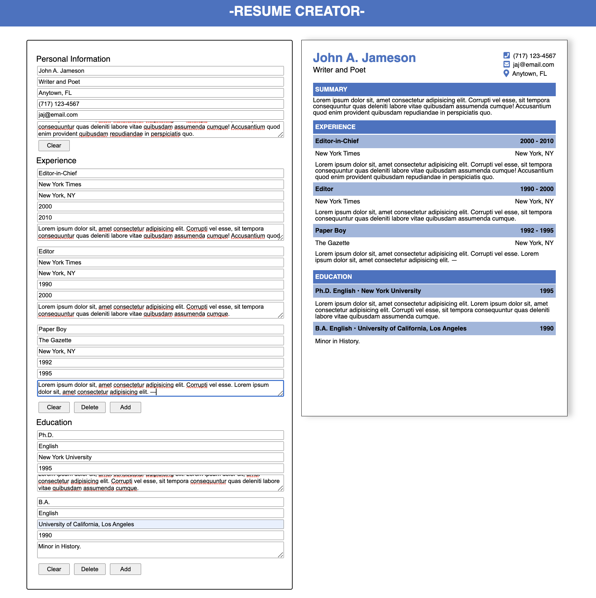

# Resume Creator

## Overview

A resume application that previews a user's provided information on an effective, stylistic resume template.

\*\* Note, as recommended for all but the most seasoned applicants, this application only allows for a one page resume at this time. Inputs longer than one page will cause the content to overflow the preview.

[Live Demo]()

## Learning Objectives

- Introduction to React and Vite
- Practice organizing application structure into React components
- Working with state and props
- Handling input fields and rendering lists in React

## Notes

This project was done as part of [The Odin Project](https://www.theodinproject.com/paths) curriculum and is the [CV Application](https://www.theodinproject.com/lessons/node-path-javascript-cv-application) project. As part of the guidelines, I am initially using class components here which will later be replaced with functional ones.

## Future Improvements

- Add print/download feature for resume templates
- Add an example resume
